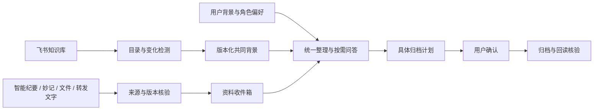

# Feishu Knowledge Agent

把飞书知识库接到你自己的 Agent：资料接收、共同背景、角色问答、每日同步，以及确认后的可编辑文档归档。

这是一个可配置的 **Skill 套件**。主入口是 `lark-research-workspace`，配套 `lark-wiki-directory` 与 `lark-meeting-source-check`。模型由宿主 Agent 或飞书云端提供，脚本不直接调用模型 API，也不读取模型密钥。

## 工作模式



| 能力 | 行为 |
| --- | --- |
| 目录同步 | 每日或手动刷新，识别新增、改名、移动与不再可见的节点 |
| 共同背景 | 用户指定根文档及其后代；仅重新读取变化正文，摘要绑定来源版本 |
| 多角色 | 管理、内容、趣味共用事实背景，分别使用偏好；用户背景独立配置 |
| 最近会议 | 按实际会议开始时间和助手通知核验，旧会议补发不能覆盖较新会议 |
| 多来源接收 | 飞书文档、妙记文字、TXT/MD/CSV/JSON/DOCX、文字PDF与已提取的外部文字 |
| 归档 | 绑定来源、版本、完整目标路径及动作，用户确认后执行并核验正文与编辑权限 |
| 变更适配 | 移出背景子树的材料退出共同背景；不可见/不可读内容和旧副本退出当前问答 |

## 安装

需要 Python 3.9+、macOS/Linux、可执行命令的 Agent，以及已用本人用户身份授权的 `lark-cli`。CLI 必须提供本仓库使用的 `wiki +node-list`、`docs +fetch` 等命令；先用 `lark-cli --help` 核对已安装版本。飞书登录及权限由每位使用者分别完成，不随本包分发。

从仓库页面选择 Code → Download ZIP 后解压，或克隆仓库。将 `skills/` 下的三个文件夹复制到宿主的 Skill 目录。Codex 可使用 `~/.codex/skills/`；已有同名版本时先比较差异或备份，再更新。也可以直接让有文件读取与命令执行能力的 Agent 读取主 Skill 的 `SKILL.md`。

本仓库的原始工作流程已在 Codex + 飞书 CLI 上实测。发布版新增的独立配置初始化和模板绑定通过离线测试；其他账号的完整云端部署仍需按下方验收。Claude Code、豆包、WorkBuddy 的 Skill 发现、执行权限和调度能力尚未逐一实测。

## 第一次配置

在仓库根目录执行以下命令，把示例值换成自己的参数。初始化只创建本地配置，不访问飞书、不创建定时任务，也不会覆盖非空目录。

```bash
python3 skills/lark-research-workspace/scripts/init_workspace.py \
  --workspace "$HOME/workspaces/feishu-knowledge" \
  --base-url 'https://YOUR-TENANT.feishu.cn' \
  --space-id 'YOUR_SPACE_ID' \
  --space-name '我的工作知识库' \
  --shared-root 'YOUR_SHARED_ROOT_NODE_TOKEN'
```

配置和运行数据应放在本仓库外。向 Agent 提供生成的 `profile.json` 路径，然后说：

> 使用 lark-research-workspace，同步我的工作知识库；配置文件是上述个人 profile.json。先报告共同背景范围，再从管理视角整理待办。

脚本也可以直接运行：

```bash
python3 skills/lark-research-workspace/scripts/workspace.py \
  --config "$HOME/workspaces/feishu-knowledge/profile.json" daily-sync
```

第一次长正文可能返回 `needs_summary`，交给宿主 Agent 按 Skill 读取完整缓存并写入版本绑定摘要。不要反复重跑整个同步。

初始为本地处理模式：目录、缓存、角色检索、资料接收、归档计划可用。接入飞书表内自动总结，按 [云端部署说明](skills/lark-research-workspace/references/cloud-setup.md) 创建自己的处理台，再填写 `cloud-config.json`。不含任何原作者的表格或文档地址。

## 常用请求

- “同步工作知识库”：刷新目录、文档版本、共同背景和已接收资料。
- “只更新目录”：使用 `lark-wiki-directory`，只读目录，不处理正文。
- “用最近一次会议测试”：先使用 `lark-meeting-source-check`，首次需配置本人纪要助手会话。
- “从管理/内容视角回答这个问题”：共用背景，按角色检索有来源的证据。
- “整理这份资料，给出归档计划”：先生成预览，等待具体确认。
- “确认归档 ARC-…”：核验对应计划未变后执行，不能把表格状态当成人工确认。

## 定时与运行边界

定时功能由宿主提供，参见 [每日同步模板](skills/lark-research-workspace/references/scheduling.md)。默认每天一次，同时保留手动触发。没有变化保持安静；有实质变化、失败或需要处理时才通知。

本地同步和归档执行需要设备与宿主在线。飞书表内总结、云端纪要/妙记事件任务配置完成后可独立运行；它们不会在设备关闭时更新本地文件。当前没有独立云端执行器、完整重试补偿队列或统一模式切换按钮。

超过45000字符的材料停在待分段处理；扫描件、音视频、图片和任意外部网页需额外提取。检索是有字符预算的词项与片段匹配，不是向量数据库。真实新会议事件、关机运行及其他账号权限须单独验收，不能由离线测试替代。

## 验证

```bash
PYTHONDONTWRITEBYTECODE=1 python3 -m unittest discover -s tests -v
python3 scripts/check_release.py
```

当前发布包通过38项离线测试、三个Skill格式校验及28个文本文件的发布检查。测试使用虚构资料和模拟 CLI，不连接真实知识库。新用户先验收只读目录，再验收背景和合成材料；最后对一份明确确认的资料执行归档。任何“待核验”写入都先回读，不能盲目重试。

公开包只包含代码、模板和虚构测试，不包含个人正文、身份、缓存、访问凭据或模型 Key。仓库发布不自动安装 Skill、不创建飞书授权，也不替用户开启 GitHub Actions。
